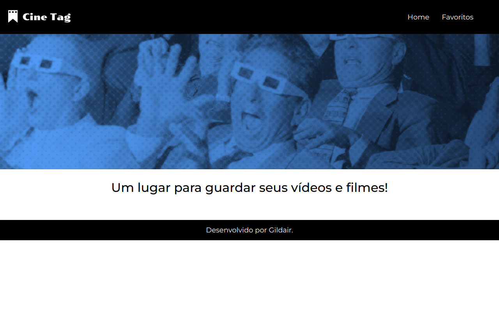

# CineTag

CineTag é uma aplicação desenvolvida em React. 
Foi pensado e idealizado para ser o primeiro projeto em contato com o hooks do React.

## 🔨 Funcionalidades do projeto

Você pode passear <a href="https://projeto-cine-tag.vercel.app/" target="_blank">no Site</a> para entender a arte conceitual do projeto. 
<b>Esse site está consumindo uma API </b>

## ✔️ Técnicas e tecnologias utilizadas

Se liga nessa lista de tudo que usaremos nessa formação:

- `React`
- `React Hooks`
- `React State`
- `JavaScript`
- `Json`
- `SASS`

E muito mais!

## 🛠️ Abrir e rodar o projeto

Para abrir e rodar o projeto, execute `npm i` para instalar as dependências e `npm start` para inicar o projeto.

Depois, acesse <a href="http://localhost:3000/">http://localhost:3000/</a> no seu navegador.
